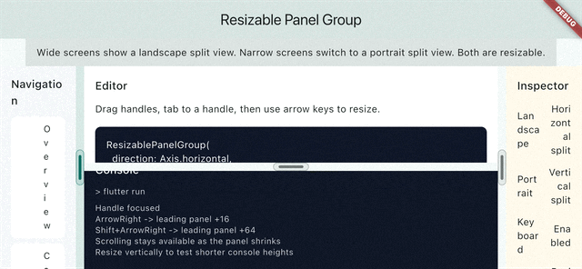
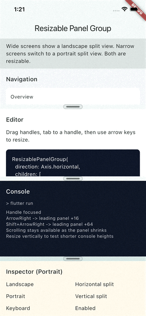

# Resizable Panel Group

[](https://pub.dev/packages/resizable_panel_group)
[](LICENSE)

Need a split view in Flutter without dragging in a heavy layout system?

This package keeps it small: accessible, Flutter-native resizable panel groups with mouse, touch, keyboard, and screen reader support.

## Features

- Horizontal and vertical panel groups
- Drag resizing for mouse and touch
- Keyboard-accessible resize handles
- Screen reader semantics for resize controls
- Nested groups for editor, inspector, and dashboard layouts
- Default handles plus custom handle builder support

## Demo

<p align="center">
  <strong>Landscape</strong>
</p>

<p align="center">
  
</p>

<p align="center">
  <strong>Portrait</strong>
</p>

<p align="center">
  
</p>

## Usage

Add the package to `pubspec.yaml`

```bash
flutter pub add resizable_panel_group
```

or

```yaml
dependencies:
  resizable_panel_group: ^0.2.0 # x-release-please-version
```

Then import the package.

```dart
import 'package:resizable_panel_group/resizable_panel_group.dart';
```

Here is a simple horizontal split view:

```dart
import 'package:flutter/material.dart';
import 'package:resizable_panel_group/resizable_panel_group.dart';

class EditorLayout extends StatelessWidget {
  const EditorLayout({super.key});

  @override
  Widget build(BuildContext context) {
    return ResizablePanelGroup(
      direction: Axis.horizontal,
      children: const [
        ResizablePanel(
          minSize: 160,
          initialSize: 240,
          child: ColoredBox(color: Color(0xFFF5F7FA)),
        ),
        ResizablePanel(
          minSize: 320,
          child: ColoredBox(color: Colors.white),
        ),
      ],
    );
  }
}
```

You can also customize the handle while keeping the built-in resize behavior:

```dart
ResizablePanelGroup(
  direction: Axis.vertical,
  handleBuilder: (context, details) {
    final color = details.isDragging ? Colors.teal : Colors.grey;

    return Center(
      child: Container(
        width: 48,
        height: 8,
        decoration: BoxDecoration(
          color: color,
          borderRadius: BorderRadius.circular(999),
        ),
      ),
    );
  },
  children: const [
    ResizablePanel(minSize: 120, initialSize: 180, child: Placeholder()),
    ResizablePanel(minSize: 120, child: Placeholder()),
  ],
)
```

### Main API

| Type | Purpose |
| :--- | :------ |
| `ResizablePanelGroup` | Owns layout, handles, pointer resizing, keyboard resizing, and semantics. |
| `ResizablePanel` | Declares a panel child plus `minSize`, `maxSize`, and `initialSize`. |
| `ResizableHandleDetails` | Passed to `handleBuilder` with `direction`, `leadingPanelIndex`, and `isDragging`. |

### `ResizablePanelGroup` options

| Property | Type | Default | Notes |
| :------- | :--- | :------ | :---- |
| `direction` | `Axis` | required | Horizontal or vertical resizing. |
| `children` | `List<ResizablePanel>` | required | Must contain at least one panel. |
| `handleExtent` | `double` | `12` | Hit area reserved for each handle. |
| `keyboardResizeAmount` | `double` | `16` | Standard arrow-key resize step. |
| `largeKeyboardResizeAmount` | `double` | `64` | Large resize step, used for Shift + Arrow. |
| `handleBuilder` | `Widget Function(BuildContext, ResizableHandleDetails)?` | `null` | Builds a custom visual for each handle. |
| `onSizesChanged` | `ValueChanged<List<double>>?` | `null` | Reports current panel sizes in logical pixels. |

### `ResizablePanel` options

| Property | Type | Default | Notes |
| :------- | :--- | :------ | :---- |
| `child` | `Widget` | required | The panel content. |
| `minSize` | `double` | `0` | Minimum main-axis size during normal layout. |
| `maxSize` | `double?` | `null` | Optional maximum main-axis size. |
| `initialSize` | `double?` | `null` | Preferred starting size before remaining space is shared. |

## Accessibility

- Handles can receive focus and be resized from the keyboard.
- Horizontal arrow behavior respects text direction.
- `Shift` + arrow uses the larger resize step.
- `Home` and `End` move the leading panel to its valid minimum or maximum size.
- Handles expose adjustable semantics for screen readers.

## Example App

The repo includes a runnable example in [`example/`](example/) that matches the demo GIFs.

```bash
cd example
fvm flutter run
```

It demonstrates:

- a landscape split workspace
- a portrait split workspace
- nested groups
- a custom handle

## Development

This project uses [FVM](https://fvm.app/) and pins Flutter `3.47.0`.

```bash
fvm install
fvm flutter pub get
fvm flutter analyze
fvm flutter test
```

## Contributing

Pull requests are welcome. If you change public behavior or the documented API, keep the README and example app in sync.

## Issues

Bug reports and feature requests are best opened in the [GitHub issue tracker](https://github.com/karloows/resizable_panel_group/issues).

## License

This project is licensed under the [MIT License](LICENSE).

## Contributors

<a href="https://github.com/karloows/resizable_panel_group/graphs/contributors">
  
</a>
